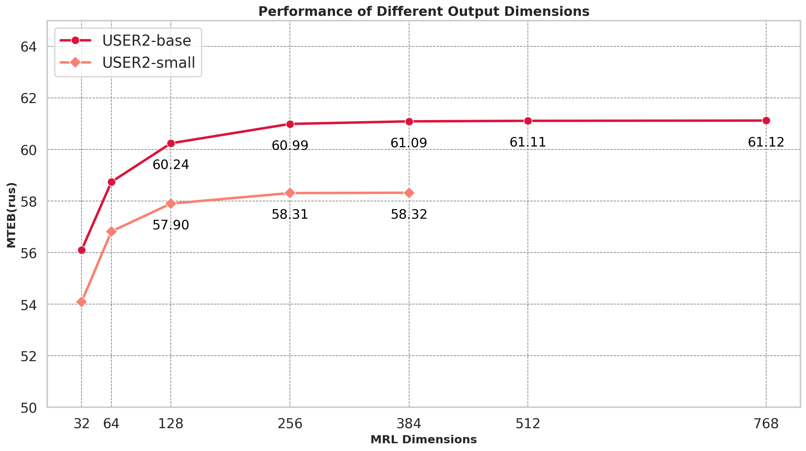
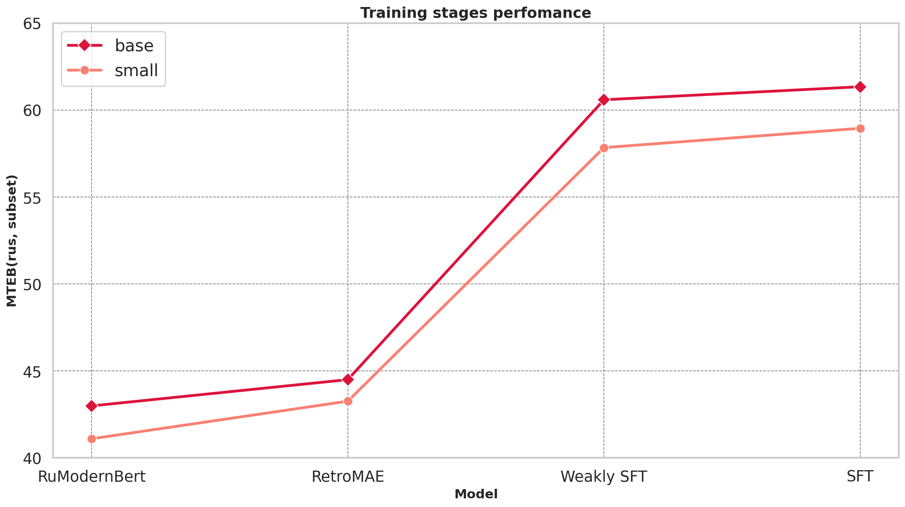

# USER2-small

This model is a part of the new **USER2** series – an evolution of the **USER** family (**U**niversal **S**entence **E**ncoder for **R**ussian), designed for efficient and accurate sentence representation with long-context support (up to 8192 tokens). The models are built on top of the strong [RuModernBERT](https://huggingface.co/collections/deepvk/rumodernbert-67b5e82fbc707d7ed3857743) architecture and show significant performance improvements for a diversity of Russian tasks.

This model also supports Matryoshka Representation Learning (MRL) — a technique that allows reducing embedding size with only a minimal drop in representation quality. It was trained with MRL dimensions `[32, 64, 128, 256, 384]`, which are therefore fully optimized for use.

| Model              | Size | Hidden Dim | Context Length |
|-------------------:|:----------:|:----------:|:--------------:|
| `deepvk/USER2-small` | 35M        | 384        | 8192           |
| [deepvk/USER2-base](https://huggingface.co/deepvk/RuModernBERT-base)  | 150M       | 768        | 8192           |

## Perfomance

To evaluate the model, we measure quality on the MTEB(rus) benchmark. Additionally, to measure long-context retrieval, we run russian subset MultiLongDocRetrieval task.

**MTEB(rus)**

| Model                                                                                          | Size  | Hidden Dim | Context Length | MRL support | Mean(task) | Mean(taskType) | Classification | Clustering | MultiLabelClassification | PairClassification | Reranking | Retrieval | STS   |
|:-----------------------------------------------------------------------------------------------|:-----:|:----------:|:--------------:|:-----------:|:----------:|:--------------:|:-------------:|:----------:|:------------------------:|:-----------------:|:---------:|:---------:|:-----:|
| USER2-small                                                                                  | 35 M  | 384        | 8192           | ✅         | 58.32      | 56.68         | 59.76         | 57.06      | 33.56                   | 54.02             | 58.26     | 61.87     | 72.25 |
| USER2-base                                                                                     | 150 M | 768        | 8192           | ✅         | 61.12      | 59.59         | 61.67         | 59.22      | 36.61                   | 56.39             | 62.06     | 66.90     | 74.28 |
| USER-base                                                                                      | 124 M | 768        | 512            | ❌         | 58.11      | 56.67         | 59.89         | 53.26      | 37.72                   | 59.76             | 55.58     | 56.14     | 74.35 |
| USER-bge-m3                                                                                    | 359 M | 1024       | 8192           | ❌         | 62.80      | 62.28         | 61.92         | 53.66      | 36.18                   | 65.07             | 68.72     | 73.63     | 76.76 |
| multilingual-e5-base                                                                           | 278 M | 768        | 512            | ❌         | 58.34      | 57.24         | 58.25         | 50.27      | 33.65                   | 54.98             | 66.24     | 67.14     | 70.16 |
| multilingual-e5-large-instruct                                                                  | 560 M | 1024       | 512            | ❌         | 65.00      | 63.36      | 66.28                   | 63.13             | 41.15     | 63.89     | 64.35 | 68.23 |  76.48 | 
| jina-embeddings-v3                                                                             | 572 M | 1024       | 8192           | ✅         | 63.45         | 60.93      | 65.24                   | 60.90             | 39.24     | 59.22     | 53.86 | 71.99 | 76.04 |
| ru-en-RoSBERTa                                                                                 | 404 M | 1024       | 512            | ❌         | 61.71         | 60.40      | 62.56                   | 56.06             | 38.88     | 60.79     | 63.89 | 66.52 | 74.13 | 


**MLDR**

In addition to the nDCG@10 score, we report the time required to encode the corpus and the peak GPU memory consumption. For USER2 models, FlashAttention is employed. Encoding is performed on an A100 GPU using the native MTEB script with a batch size of 32.

| Model     | Size | nDCG@10 ↑ |
|----------:|:---------:|:---------:|
| USER2-small |  35M   | 51.69     |
| USER2-base  |  150M   | 54.17     |
| USER-bge-m3  |  359M    |58.53     | 
| KaLM-v1.5     |   494M     |  53.75 | 
| jina-embeddings-v3 | 572M  | 49.67  |
| E5-mistral-7b |   7.11B   |52.40  |

**MRL**

To evaluate MRL capabilities, we again use MTEB(rus), this time by cropping the embedding dimensions to the chosen size.



## Usage

### Prefixes

This model is trained similarly to [Nomic Embed](https://huggingface.co/nomic-ai/nomic-embed-text-v1.5#task-instruction-prefixes) and expects task-specific prefixes to be added to the input. The choice of prefix depends on the specific task. We follow a few general guidelines when selecting a prefix:
- "classification: " is the default and most universal prefix, often performing well across a variety of tasks.
- "clustering: " is recommended for clustering applications: group texts into clusters, discover shared topics, or remove semantic duplicates.
- "search_query: " and "search_document: " are intended for retrieval and reranking tasks. Also, in some classification tasks, especially with shorter texts, “search_query” shows superior performance to other prefixes. On the other hand, search_document can be beneficial for long-context sentence similarity tasks.

However, we encourage users to experiment with different prefixes, as certain domains may benefit from specific ones.

### Sentence Transformers

```python
from sentence_transformers import SentenceTransformer

model = SentenceTransformer("deepvk/USER2-small")

query_embeddings = model.encode(["Когда был спущен на воду первый миноносец «Спокойный»?"], prompt_name="search_query")
document_embeddings = model.encode(["Спокойный (эсминец)\nЗачислен в списки ВМФ СССР 19 августа 1952 года."], prompt_name="search_document")

similarities = model.similarity(query_embeddings, document_embeddings)
```

<details><summary>Sentence Transformers usage with MRL</summary>

In Sentence Transformers, you can reduce the embedding dimensionality using the **truncate_dim** parameter when loading the SentenceTransformer model. This model was trained with dimensions `[32, 64, 128, 256, 384]`, so it’s recommended to use one of these for best performance.

```python
model = SentenceTransformer("deepvk/USER2-small", truncate_dim=128)
```

</details>

### Transformers

```python
import torch
import torch.nn.functional as F
from transformers import AutoTokenizer, AutoModel


def mean_pooling(model_output, attention_mask):
    token_embeddings = model_output[0]
    input_mask_expanded = (
        attention_mask.unsqueeze(-1).expand(token_embeddings.size()).float()
    )
    return torch.sum(token_embeddings * input_mask_expanded, 1) / torch.clamp(
        input_mask_expanded.sum(1), min=1e-9
    )


queries = ["search_query: Когда был спущен на воду первый миноносец «Спокойный»?"]
documents = ["search_document: Спокойный (эсминец)\nЗачислен в списки ВМФ СССР 19 августа 1952 года."]

tokenizer = AutoTokenizer.from_pretrained("deepvk/USER2-small")
model = AutoModel.from_pretrained("deepvk/USER2-small")

encoded_queries = tokenizer(queries, padding=True, truncation=True, return_tensors="pt")
encoded_documents = tokenizer(documents, padding=True, truncation=True, return_tensors="pt")

with torch.no_grad():
    queries_outputs = model(**encoded_queries)
    documents_outputs = model(**encoded_documents)

query_embeddings = mean_pooling(queries_outputs, encoded_queries["attention_mask"])
query_embeddings = F.normalize(query_embeddings, p=2, dim=1)
doc_embeddings = mean_pooling(documents_outputs, encoded_documents["attention_mask"])
doc_embeddings = F.normalize(doc_embeddings, p=2, dim=1)

similarities = query_embeddings @ doc_embeddings.T
```

<details><summary>Transformers usage with MRL</summary>

```python

query_embeddings = mean_pooling(queries_outputs, encoded_queries["attention_mask"])
query_embeddings = query_embeddings[:, :truncate_dim]
query_embeddings = F.normalize(query_embeddings, p=2, dim=1)
# and the same for doc_embeddings
```
</details>

## Training details

This is the small version with 35 million parameters based on RuModernBert-small. It was fine-tuned for three stages: RetroMAE, weakly supervised fine-tuning, supervised fine-tuning.

Following the bge-m3 training strategy, we use RetroMAE as a retrieval-oriented continuous pretraining step. Leveraging data from the final stage of RuModernBERT training, RetroMAE enhances retrieval quality - particularly for long-context inputs.

To follow best practices for building SOTA encoder, we rely on large-scale training with weakly related text pairs. However, such datasets are not publicly available for Russian, unlike for English or Chinese. To overcome this, we apply two complementary strategies:
- **Cross-lingual transfer**: We train on both English and Russian data, leveraging English resources (nomic-unsupervised) alongside our in-house English-Russian parallel corpora.
- **Unsupervised pair mining**: From [deepvk/cultura_ru_edu](deepvk/cultura_ru_edu) corpus, we extract 50M pairs using a simple heuristic – selecting non-overlapping text blocks that are not substrings of one another.

This approach shows promising results, as we were able to train strong-performing models with almost no pairs in the target language, compared to training pipelines for other languages. The table below shows the datasets used and the number of times each was upsampled.

| Dataset                     | Size | Upsample |
|----------------------------:|:----:|:-------:|
| [nomic-en](https://github.com/nomic-ai/nomic)                    | 235M |   1      |
| [nomic-ru](https://github.com/nomic-ai/nomic)                    | 39M  |   3      |
| en-ru parallel              | 250M |   1      |
| [cultura-sampled](https://huggingface.co/datasets/deepvk/cultura_ru_edu)             | 50M  |   1      |
| **Total**                   | 652M |          |

For the third stage, we switch to cleaner, task-specific datasets. In some cases, we applied additional filtering using a cross-encoder. For all retrieval datasets we mine hard-negatives. 

| Dataset                                                                                                                                          | Examples | Notes                                     |
|:-------------------------------------------------------------------------------------------------------------------------------------------------|:--------:|:------------------------------------------|
| [Nomic-en-supervised](https://huggingface.co/datasets/nomic-ai/nomic-embed-supervised-data)                                                     | 1.7 M    | Unmodified                                |
| AllNLI                                                                                                                                            | 200 K    | Translated SNLI/MNLI/ANLI to Russian      |
| [fishkinet-posts](https://huggingface.co/datasets/nyuuzyou/fishkinet-posts)                                                                       | 93 K     | Title–content pairs                       |
| [gazeta](https://huggingface.co/datasets/IlyaGusev/gazeta)                                                                                        | 55 K     | Title–text pairs                          |
| [habr_qna](https://huggingface.co/datasets/its5Q/habr_qna)                                                                                        | 100 K    | Title–description pairs                   |
| [lenta](https://huggingface.co/datasets/zloelias/lenta-ru)                                                                                        | 100 K    | Title–news pairs                          |
| [miracl_ru](https://huggingface.co/datasets/Shitao/bge-m3-data)                                                                                   | 10 K     | One positive per anchor                   |
| [mldr_ru](https://huggingface.co/datasets/Shitao/bge-m3-data)                                                                                     | 1.8 K    | Unmodified                                |
| [mr-tydi_ru](https://huggingface.co/datasets/Shitao/bge-m3-data)                                                                                  | 5.3 K    | Unmodified                                |
| [mmarco_ru](https://huggingface.co/datasets/unicamp-dl/mmarco)                                                                                    | 500 K    | Unmodified                       |
| [ru-HNP](https://huggingface.co/datasets/deepvk/ru-HNP)                                                                                           | 100 K    | One pos + one neg per anchor              |
| ru‑queries                                                                                                                                         | 199 K    | In-house (generated as in [arXiv:2401.00368](https://arxiv.org/abs/2401.00368)) |
| [ru‑WaNLI](https://huggingface.co/datasets/deepvk/ru-WANLI)                                                                                        | 35 K     | Entailment -> pos, contradiction ->neg         |
| [sampled_wiki](https://huggingface.co/datasets/wikimedia/wikipedia)                                                                                | 1 M      | Sampled text blocks from Wikipedia        |
| [summ_dialog_news](https://huggingface.co/datasets/CarlBrendt/Summ_Dialog_News)                                                                    | 37 K     | Summary–info pairs                        |
| [wikiomnia_qna](https://huggingface.co/datasets/RussianNLP/wikiomnia)                                                                              | 100 K    | QA pairs (T5-generated)                  |
| [yandex_q](https://huggingface.co/datasets/its5Q/yandex-q)                                                                                         | 83 K     | Q+desc-answer pairs                     |
| **Total**                                                                                                                                        | 4.3 M    |                                           |

Alongside the final model, we also release all intermediate training steps. Both the **retromae** and **weakly_sft** models are available under the specified revisions in this repository. We hope these additional models prove useful for your experiments. Below is a comparison of all training stages on a subset of MTEB(rus).




## Citations

```
@misc{deepvk2025user,
    title={USER2},
    author={Malashenko, Boris and Spirin, Egor and Sokolov Andrey},
    url={https://huggingface.co/datasets/deepvk/USER2-base},
    publisher={Hugging Face}
    year={2025},
}
```
